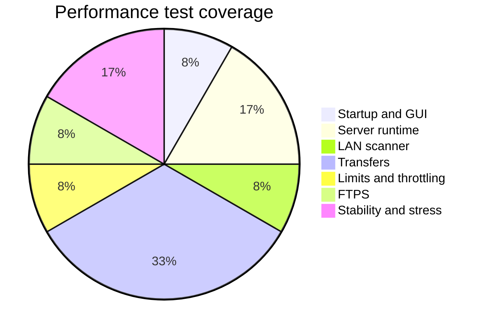
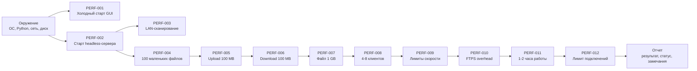
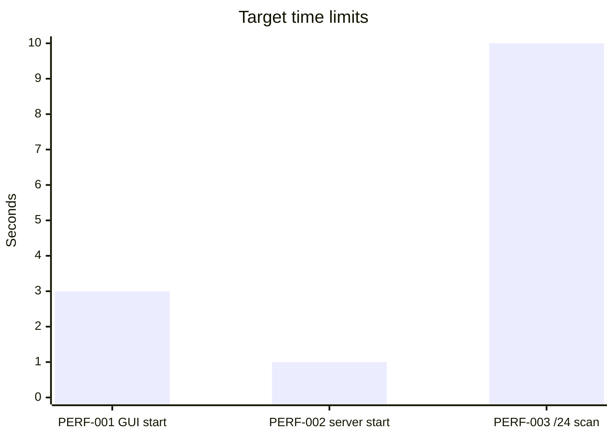
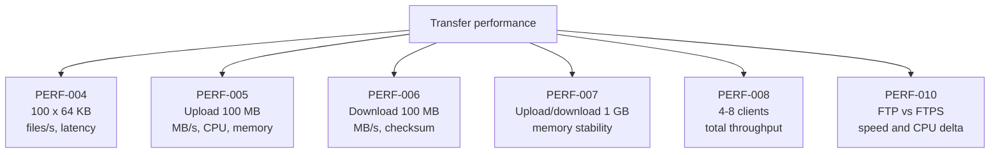
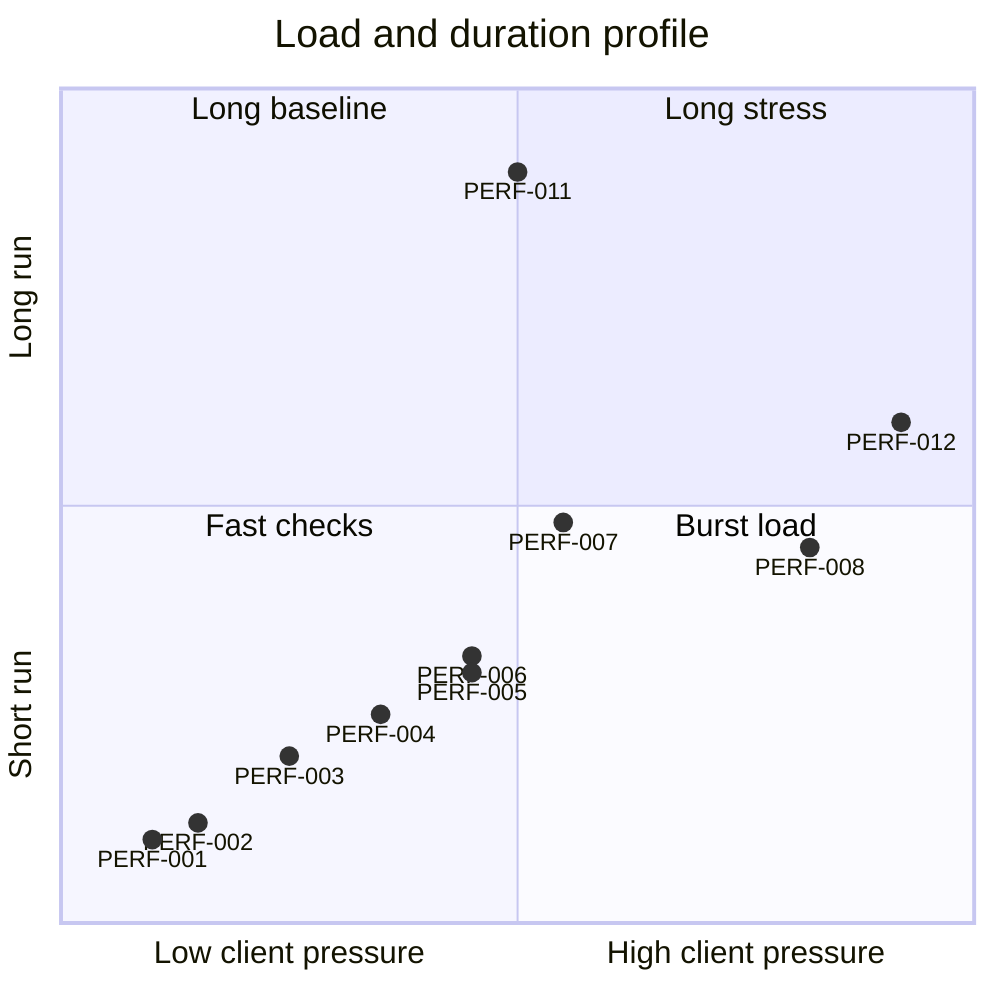

# Performance graphs

Графики построены на основе сценариев из [таблицы тестов производительности](PERFORMANCE_TESTS.md). Они показывают покрытие проверок, порядок прогона и целевые ориентиры там, где в тест-плане уже задан числовой порог.

## Покрытие сценариев

## Порядок прогона

## Целевые временные ориентиры

## Матрица transfer-тестов

## Нагрузка и длительность

## Что вносить после реального прогона

После замеров добавляйте фактические значения в таблицу результатов и обновляйте графики:

- для startup/scanner: секунды;
- для upload/download: `MB/s`;
- для parallel clients: суммарный `MB/s` и число ошибок;
- для long run: пиковая память и количество зависших сессий;
- для FTPS: процентное отличие от FTP.
